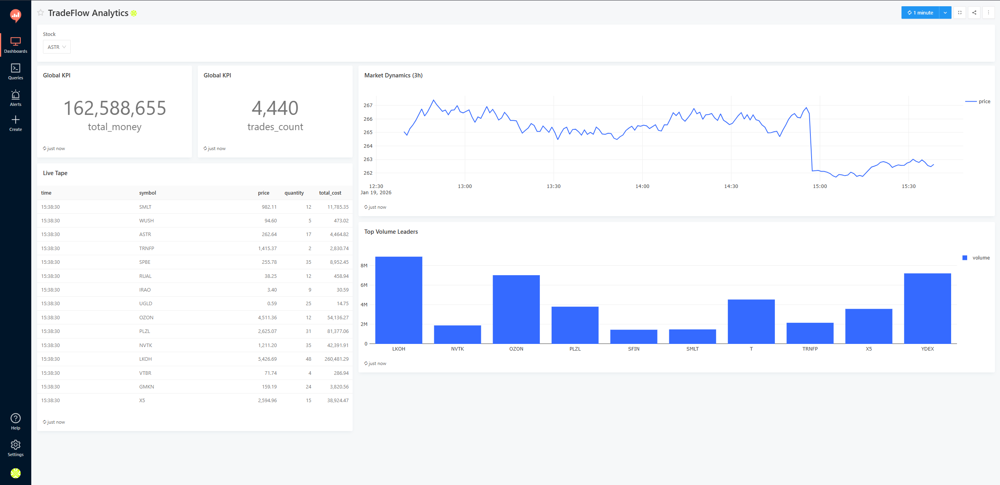

# TradeFlow Analytics

TradeFlow Analytics — это программный комплекс для сбора, хранения и визуализации биржевых данных в режиме реального времени. Система построена на микросервисной архитектуре с использованием Docker и обеспечивает непрерывный поток данных путем автоматического переключения между реальным API Московской Биржи (MOEX) и режимом математической симуляции торгов.

## Оглавление
1. [Описание архитектуры](#описание-архитектуры)
2. [Структура проекта](#структура-проекта)
3. [Схема базы данных](#схема-базы-данных)
4. [Функциональное описание генератора данных](#функциональное-описание-генератора-данных)
5. [Инструкция по запуску](#инструкция-по-запуску)
6. [Настройка визуализации (Redash)](#настройка-визуализации-redash)

---

## Описание архитектуры

Проект состоит из следующих изолированных сервисов, управляемых Docker Compose:

- **Generator:** Выполняет запросы к внешнему API, обрабатывает данные и записывает их в базу данных.
- **PostgreSQL :** Реляционная база данных. Хранит историю сделок и справочную информацию.
- **Redash :** BI-платформа для построения дашбордов и SQL-аналитики.
- **Redis:** Брокер сообщений и кэш, необходимый для работы очередей Redash.

---

## Структура проекта

Ниже приведено описание назначения основных директорий и файлов проекта:

- `generator/` — Исходный код сервиса сбора данных.
  - `main.py` — Основной исполняемый скрипт (логика работы с API и БД).
  - `Dockerfile` — Инструкции для сборки образа генератора.
  - `requirements.txt` — Список зависимостей Python.
- `db_init/` — Скрипты инициализации базы данных.
  - `init.sh` — SQL-скрипт, создающий таблицы и индексы при первом запуске контейнера PostgreSQL.
- `dashboard.png` — Скриншот готового дашборда для демонстрации возможностей системы.



- `tradeflow_dashboard.json` — Полный файл конфигурации дашборда (содержит структуру виджетов, параметры визуализации и SQL-запросы). Служит резервной копией настроек.
- `docker-compose.yml` — Манифест оркестрации контейнеров.
- `run.bat` — Скрипт автоматического запуска для ОС Windows.
- `run.sh` — Скрипт автоматического запуска для Linux/macOS.
- `.env` — Файл переменных окружения (генерируется автоматически при запуске скриптов `run`).

---

## Схема базы данных

Данные хранятся в базе данных `tradeflow_db`. Основные таблицы:

### 1. Таблица `companies` (Справочник)
Содержит список отслеживаемых финансовых инструментов. Обновляется автоматически при старте генератора.

| Название столбца | Тип данных | Описание |
| :--- | :--- | :--- |
| `symbol` | VARCHAR(10) | Тикер акции (первичный ключ). Пример: SBER, GAZP. |
| `name` | VARCHAR(255) | Полное наименование компании или инструмента. |

### 2. Таблица `trades` (Факты сделок)
Содержит исторические и оперативные данные о торгах.

| Название столбца | Тип данных | Описание |
| :--- | :--- | :--- |
| `id` | SERIAL | Уникальный идентификатор записи (автоинкремент). |
| `timestamp` | TIMESTAMP | Время совершения сделки или генерации записи. |
| `symbol` | VARCHAR(10) | Тикер инструмента (внешний ключ к `companies`). |
| `price` | DECIMAL | Цена сделки. |
| `quantity` | INTEGER | Количество лотов в сделке. |
| `total_cost` | DECIMAL | Общий объем сделки (Цена * Количество). |

*Примечание: Для оптимизации выборок создан индекс по полю `timestamp`.*

---

## Функциональное описание генератора данных

Скрипт `generator/main.py` реализует следующую логику работы:

1. **Инициализация (Top-20):**
   При запуске скрипт запрашивает у Мосбиржи список всех торгуемых акций, сортирует их по объему торгов за текущий день и выбирает топ-20 ликвидных инструментов. Этот список сохраняется в оперативной памяти.

2. **Предзагрузка истории (Preload):**
   Для обеспечения непрерывности графиков при старте системы загружаются минутные свечи за последние 3 часа.
   - **Режим REAL:** Данные скачиваются через API Мосбиржи.
   - **Режим SIMULATION:** Если биржа недоступна, генерируются синтетические исторические данные.

3. **Цикл сбора данных (Loop):**
   Каждую секунду скрипт выполняет итерацию обновления:
   - **Режим REAL:** Запрашивает текущие рыночные цены через API.
   - **Режим SIMULATION:** Если рынок закрыт или выбран режим симуляции, цены рассчитываются по алгоритму Random Walk (случайное блуждание) на основе последней известной цены.
   - **Запись:** Сформированные данные записываются в таблицу `trades`.

---

## Инструкция по запуску

Для работы системы требуются установленные Docker и Docker Compose.

### 1. Запуск в Windows
Запустите файл `run.bat`. Скрипт выполнит следующие действия:
- Запросит желаемый режим работы (REAL или SIMULATION).
- Сгенерирует файл конфигурации `.env` с переменными окружения и учетными данными.
- Соберет образы и запустит контейнеры в фоновом режиме.

### 2. Запуск в Linux / macOS
Откройте терминал и выполните команды:
```bash
chmod +x run.sh
./run.sh
```

### 3. Остановка системы

Для корректной остановки и удаления контейнеров выполните команду:

```bash
docker-compose down
```

---

## Настройка визуализации (Redash)

Поскольку Redash хранит конфигурацию дашбордов во внутренней базе данных, при первом развертывании на новой машине требуется базовая настройка.

Доступ к веб-интерфейсу: http://localhost:5000


